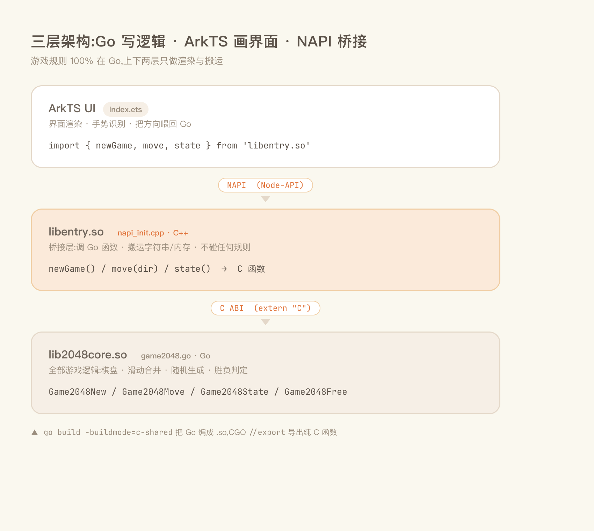
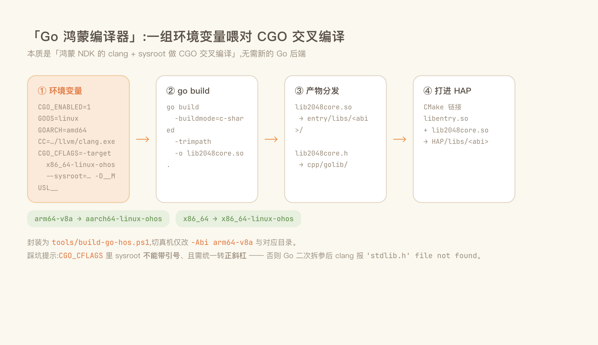
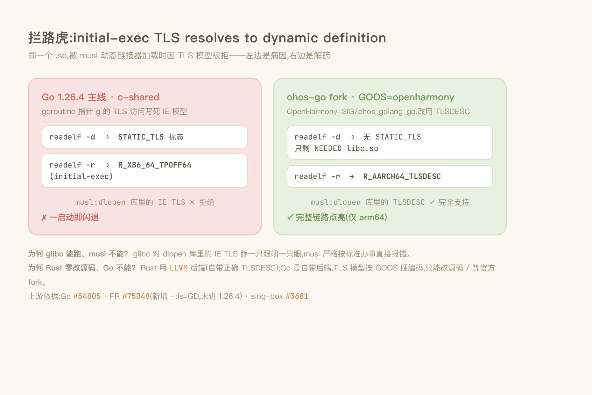
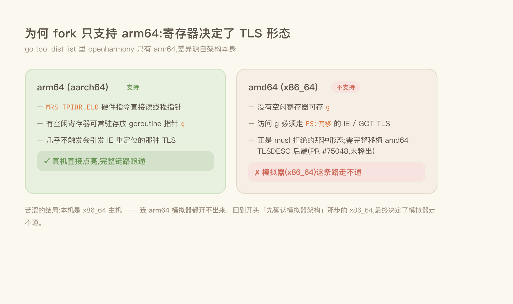
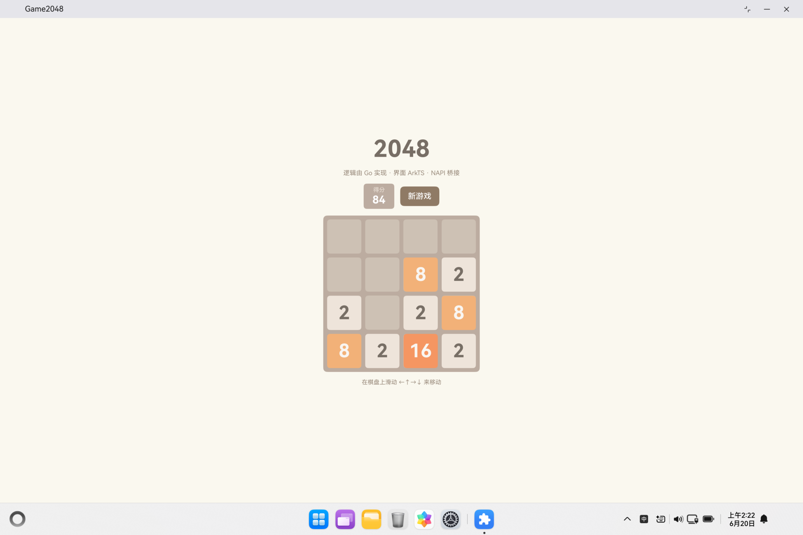

# 把 Go 塞进鸿蒙PC:windows上用 c-shared 跑 2048

> 欢迎加入开源鸿蒙PC社区： https://harmonypc.csdn.net/
>
> 
>
> 一句话剧透:游戏逻辑全用 Go 写,界面用 ArkTS,中间用 NAPI 桥接。技术上完全跑通了——但只在 **arm64 真机**上跑得通。x86_64 模拟器栽在了一个你几乎不可能提前预料到的地方:**Go 的 TLS 模型和鸿蒙 musl libc 合不来。**

这篇文章记录我如何从一个空环境,一步步把「Go 写核心、ArkTS 画界面、跑在鸿蒙上」这条链路打通,以及中途那个看似一切正常、却一启动就闪退的 bug 是怎么被一层层剥开的。如果你也想在鸿蒙上复用一段非 C/C++ 的原生逻辑,这篇也许能帮你少走几天弯路。

---

## 为什么是「Go + ArkTS」这种奇怪组合

一个常见但很实际的需求:你已经有一段成熟的、经过实战检验的核心逻辑(用 Go 写的),不想在鸿蒙上用 ArkTS 重写一遍。能不能直接复用?

答案是能,而且不需要重造轮子。整体架构是三层:



职责切得很干净:

- **游戏逻辑 100% 在 Go**——棋盘、滑动合并、随机生成、胜负判定,一行规则都不在别处。
- Go 用 `-buildmode=c-shared` 编成 `.so`,通过 CGO 的 `//export` 导出纯 C 函数。
- C++ NAPI 层只干两件事:调 Go 函数、搬运字符串/内存。不碰任何游戏规则。
- ArkTS 只负责把状态 JSON 渲染成棋盘,再把滑动方向喂回给 Go。

**这里有个关键认知,能省掉大量焦虑**:你不需要为鸿蒙写一个新的 Go 编译器后端。Go 官方工具链早就能生成 arm64/x86_64 机器码;鸿蒙内核是 Linux 系,libc 用 musl。缺的只是一层封装——「用鸿蒙 NDK 的 clang + sysroot 做 CGO 交叉编译」。这一层,就是本文里被我半开玩笑称作「Go 鸿蒙编译器」的东西。

> 环境前提:Windows 11 + PowerShell;目标 HarmonyOS 6.1.1 (API 24) 模拟器。

---

## 第一步:把工具备齐

| 组件 | 版本 | 说明 |
|---|---|---|
| ark-cli | 0.1.2 | 鸿蒙命令行脚手架(内嵌 hdc) |
| 鸿蒙统一运行时 | API 24 | SDK + Emulator + hvigor + ohpm + node + hdc |
| Go | 1.26.4 | `winget install GoLang.Go` |
| NDK clang | 15.0.4 (OHOS) | 随 SDK 提供,CGO 交叉编译用 |

鸿蒙这边用 ark-cli 一把梭,不必装完整 DevEco:

```powershell
ark runtime install   # 全新机器:自动下载当前平台 command-line-tools
ark runtime status    # 确认 SDK / Emulator / hvigorw / ohpm / node / hdc 均 OK
```

运行时落在 `C:\Users\<用户>\.ark-cli\runtime\`,SDK 根在 `...\runtime\sdk\default\openharmony`。

Go 直接 winget:

```powershell
winget install --id GoLang.Go -e --accept-package-agreements --accept-source-agreements
& "C:\Program Files\Go\bin\go.exe" version   # go version go1.26.4 windows/amd64
```

---

## 第二步:摸清鸿蒙 NDK 的交叉编译家底

SDK 里其实自带了完整的 LLVM 和 sysroot,我们要做的只是把参数喂对:

```
<SDK>\native\llvm\bin\clang.exe                       # 编译器(Windows 宿主版)
<SDK>\native\sysroot\usr\include\                     # 头文件 stdlib.h / pthread.h ...
<SDK>\native\sysroot\usr\include\x86_64-linux-ohos\   # 架构相关头
<SDK>\native\sysroot\usr\lib\x86_64-linux-ohos\       # 库 libace_napi.z.so ...
<SDK>\native\build\cmake\ohos.toolchain.cmake         # CMake 工具链
```

有意思的细节:`llvm\bin\` 下那个 `aarch64-unknown-linux-ohos-clang` 其实是个 `#!/bin/sh` wrapper(Windows 根本跑不了),它的本体不过是:

```sh
clang -target aarch64-linux-ohos --sysroot=<sysroot> -D__MUSL__ "$@"
```

知道这点后就豁然开朗了:**在 Windows 上,我直接调 `clang.exe` 并手动带上这三组参数即可。** ABI 和 triple 的对应关系:

| ABI | GOARCH | clang target triple |
|---|---|---|
| arm64-v8a | arm64 | aarch64-linux-ohos |
| x86_64 | amd64 | x86_64-linux-ohos |
| armeabi-v7a | arm | arm-linux-ohos |

---

## 第三步:先确认模拟器是什么架构(别跳过这步)

native `.so` 的架构必须和设备完全一致,否则装上去直接加载失败。所以动手编译前,先问清楚模拟器的 CPU:

```powershell
ark hdc shell uname -m                              # -> x86_64
ark hdc shell param get const.product.cpu.abilist   # -> x86_64
```

> 结论:本机鸿蒙模拟器是 **x86_64**,不是 arm64。
> 所以 Go 得编成 `x86_64-linux-ohos`,`abiFilters` 也只放 `x86_64`。
> ——记住这个 x86_64,它后面会变成整个故事的主角。

---

## 第四步:造那台「Go 鸿蒙编译器」

核心配方其实就是一组环境变量:

```
CGO_ENABLED = 1
GOOS        = linux
GOARCH      = amd64                      # 按 ABI 取值
CC          = <SDK>\native\llvm\bin\clang.exe
CGO_CFLAGS  = -target x86_64-linux-ohos --sysroot=<sysroot 正斜杠> -D__MUSL__
CGO_LDFLAGS = -target x86_64-linux-ohos --sysroot=<sysroot 正斜杠>
```

然后:

```
go build -buildmode=c-shared -trimpath -o lib2048core.so .
```

我把它封装成了 `tools/build-go-hos.ps1`,一条命令完成「设环境 → 编译 → 把 `.so` 拷进 `entry/libs/<abi>/`、`.h` 拷进 golib/」:

```powershell
& tools\build-go-hos.ps1 `
    -Src     Game2048\entry\src\main\cpp\go `
    -OutName lib2048core `
    -Abi     x86_64 `
    -LibsDir   Game2048\entry\libs\x86_64 `
    -HeaderDir Game2048\entry\src\main\cpp\golib
```

切真机时只改 `-Abi arm64-v8a` 和对应目录即可。生成的头文件暴露四个函数:

```c
extern char* Game2048New(void);
extern char* Game2048Move(int dir);
extern char* Game2048State(void);
extern void  Game2048Free(char* p);
```

整条交叉编译链路一图概览——从环境变量到打进 HAP:



### 这一步踩的两个坑(都伪装成同一个报错)

两次都是 `'stdlib.h' file not found`,但根因完全不同:

**坑一:sysroot 带了引号。** 我一开始写成 `--sysroot="<path>"`,把引号也塞进了 `CGO_CFLAGS`。问题是 Go 会把 `CGO_CFLAGS` 按空格再拆一遍传给 clang,引号被当成了路径的一部分,自然找不到头文件。**去掉引号**即可(鸿蒙 runtime 目录默认无空格)。

**坑二:Windows 反斜杠路径。** 去掉引号后还是报同样的错。诡异的是:直接在命令行用反斜杠调 clang 一切正常,但经 Go 二次处理后 clang 就解析不到搜索路径了。**修复:把 sysroot 统一转成正斜杠** `C:/Users/...`,脚本里用 `$sysroot -replace '\\','/'` 处理。

> 定位这类坑的杀手锏:`go build -x` 打印出 Go 真正传给 clang 的命令行,一看便知。
> 验证工具链本身没问题:`clang -target x86_64-linux-ohos --sysroot=... -E -x c -v /dev/null`,看 `#include <...> search starts here` 里有没有 `usr/include`。

---

## 第五、六步:NAPI 桥 + 工程接线

桥接层很薄。`napi_init.cpp` 注册 `newGame/move/state` 三个方法,每次把 Go 返回的 C 字符串拷进 napi string 后**立刻 `Game2048Free` 释放**(Go 那边 malloc 的内存得自己还)。

CMake 把 Go 产物链进来:

```cmake
add_library(entry SHARED napi_init.cpp)
set(GO_LIB ${NATIVERENDER_ROOT_PATH}/../../../libs/${OHOS_ARCH}/lib2048core.so)
target_link_libraries(entry PUBLIC ${GO_LIB} libace_napi.z.so)
```

`OHOS_ARCH` 由 `ohos.toolchain.cmake` 注入;`libentry.so` 运行时靠 DT_NEEDED 找同目录的 `lib2048core.so`,两个 `.so` 都会被打进 HAP 的 `libs/<abi>`。

工程侧三处接线:

```json5
// build-profile.json5
"externalNativeOptions": {
  "path": "./src/main/cpp/CMakeLists.txt",
  "abiFilters": ["x86_64"]
}
// oh-package.json5
"dependencies": { "libentry.so": "file:./src/main/cpp/types/libentry" }
```

ArkTS 侧 `Index.ets` 渲染 4×4 棋盘,用 `PanGesture` 取位移较大的轴判定方向,调 native `move(dir)`。

构建运行:

```powershell
& tools\build-go-hos.ps1 -Src ...\cpp\go -Abi x86_64 -LibsDir ...\libs\x86_64 -HeaderDir ...
cd Game2048 && ark build --mode debug
ark emulator start phone24 && ark devices
ark run --monitor          # 构建→安装→启动→看日志
```

构建成功。签名成功。安装成功。启动……

---

## 拦路虎:一启动就闪退,而且死得明明白白

应用一打开就崩。崩溃日志(jscrash)很干脆:

```
Error relocating .../lib2048core.so: initial-exec TLS resolves to dynamic definition
→ load module libentry failed
→ export objects of native so is undefined   (所以 ArkTS 侧 game 是 undefined)
```

报错的不是我的代码,是动态链接器在加载 `lib2048core.so` 时拒绝了一个 TLS 重定位。这一行 `initial-exec TLS resolves to dynamic definition`,把我拖进了接下来一整夜。

下面这张图把整个病因与解药对照起来——左边是 Go 主线为何被 musl 拒绝,右边是官方 fork 如何用 TLSDESC 解决:



### 根因:Go 的 TLS 模型 vs 鸿蒙的 musl

线程本地存储(TLS)有几种访问模型,其中 **initial-exec (IE)** 是最快但最不灵活的一种——它假设这个变量在程序启动时就已经布局好了,因此**不适合被 `dlopen` 动态加载的库**。

事情就坏在这:

- Go 主线编译器对 goroutine 指针 `g` 的 TLS 访问,在 c-shared 模式下**写死了 IE 模型**,还给 `.so` 打上 `STATIC_TLS` 标志(`llvm-readelf -d` 能看到 `STATIC_TLS`,`-r` 能看到 `R_X86_64_TPOFF64`)。
- 而鸿蒙的 libc 是 **musl 系**,它**拒绝**在 `dlopen` 进来的库里解析 IE 模型的 TLS。glibc 对此睁一只眼闭一只眼,musl 严格按标准办事,直接报错。

这不是我一个人的倒霉,是有据可查的上游问题:

- Go issue [#54805](https://github.com/golang/go/issues/54805);鸿蒙同款现象见 [sing-box #3681](https://github.com/SagerNet/sing-box/issues/3681)。
- 修复在 Go PR [#75048](https://github.com/golang/go/pull/75048)——新增 `-tls=GD`,让 amd64/arm64 改用 TLSDESC。但它**没进 Go 1.26.4**(我的 `go tool link` 根本没有 `-tls` 这个开关)。

### 试过、且全部无效的几条路

为了不改 Go 源码,我挣扎了很久:

1. **`CGO_CFLAGS` 加 `-ftls-model=global-dynamic`**——无效。IE 来自 Go runtime 自身的 `runtime.tlsg`,不在 C 侧,改 C 编译选项管不着它。
2. **`GOOS=android` 借 Android 的 `runtime.tls_g` 方案**——编译失败,`gcc_android.c` 要 bionic 的 `android/log.h`,OHOS sysroot 里没有。
3. **把 Android 那套轻量 `tls_g` hack 移植到 linux**——实测不可行。Android 靠 bionic 预留的 `TLS_SLOT_APP` 槽,用「`pthread_setspecific` 写个魔数 + 按固定偏移扫描线程指针」来定位 `g`。但在 OHOS 上:
   - sysroot **没有** `TLS_SLOT_APP` 之类的预留槽;
   - 我写了个最小 C 程序丢到设备上实测:`pthread_setspecific` 写进去的值,在线程指针 TP 的 `[-512, 512]` 偏移范围内**根本扫不到**(musl 的 TSD 是独立分配、指针间接的,不在 TP 的固定偏移处)。
   - 结论:musl 上拿不到「相对 FS 寄存器的固定偏移 g 槽」,Android 的 hack 彻底失效。

### 为什么 Rust 能「零改源码」,Go 不能

你可能听过 ohos-rust——Rust 上鸿蒙几乎不用动编译器,为什么 Go 这么难?

差别在后端:**Rust 用 LLVM。** LLVM 早就支持 `*-unknown-linux-ohos` 目标,自带正确的 TLSDESC/GD TLS 代码生成。所以 ohos-rust 只要写个 target spec、把 ohos clang 指定成 linker 就行,编译器本身一行不改。

而 **Go 用的是自己的编译器/链接器后端(不是 LLVM)**,TLS 模型是按 GOOS 硬编码在后端里的,没有外部 target spec 这种开关。想让 Go 吐出 TLSDESC,**就必须改 Go 源码**。换句话说,「做一个 ohos-go」本质上就是给 Go 打一次源码补丁、维护一个 fork。

### 最终方案:官方的 ohos-go fork

好消息是,鸿蒙官方 SIG 已经把这个 fork 做好了——`OpenHarmony-SIG/ohos_golang_go`,加了 `GOOS=openharmony` 目标,并用 **TLSDESC** 解决了 TLS 问题:

```bash
# 1) 克隆,用本机 stock Go 作 bootstrap 把工具链编出来
git clone --depth 1 -b release-branch.go1.24 \
    https://gitcode.com/openharmony-sig/ohos_golang_go  F:/code/2048-go/ohos-go
cd F:/code/2048-go/ohos-go/src
set "GOROOT_BOOTSTRAP=C:\Program Files\Go" && .\make.bat   # 产出 ohos-go\bin\go.exe

# 2) 用这个 fork 重新交叉编译(脚本已默认指向它)
#    GOROOT=ohos-go  GOOS=openharmony  CC=鸿蒙 clang
& tools\build-go-hos.ps1 -Src ...\cpp\go -Abi arm64-v8a -LibsDir ...\libs\arm64-v8a -HeaderDir ...
```

产物用 `llvm-readelf` 验证,这次干干净净:

- `-d`:**没有 STATIC_TLS 标志**了,只剩 `NEEDED libc.so`;
- `-r`:TLS 重定位变成了 **`R_AARCH64_TLSDESC`**——musl 对 dlopen 库里的 TLSDESC 完全支持。

### 但有个让人意难平的限制:只支持 arm64

注意上面命令里的 `-Abi arm64-v8a`。这个 fork **只支持 `openharmony/arm64`**(`go tool dist list` 里只有 arm64)。原因是架构本身的差异:

- **arm64** 用 `MRS TPIDR_EL0` 硬件指令直接读线程指针,还能拿寄存器存 `g`,几乎不触发会引发 IE 重定位的那种 TLS;
- **amd64** 没有空闲寄存器,访问 `g` 必须走 `FS:偏移` 的 IE/GOT TLS——正好就是 musl 拒绝的那种形态。要让它走 TLSDESC,得完整移植一遍 amd64 的 TLSDESC 后端(就是上游那个还没释出的 PR #75048)。



于是结局有点苦涩:

- **arm64 真机** → 可以直接点亮,完整链路跑通;
- **x86_64 模拟器(amd64)** → fork 不支持。而且我用的是 x86_64 主机,**连 arm64 模拟器都开不出来**。

> 所以,回到文章开头那个「先确认模拟器架构」的步骤——正是那一步的 x86_64,在最后决定了模拟器这条路走不通。

---

## 结论与可复用的经验

**面向 arm64 真机时,这条「Go → NAPI → ArkTS」的 2048 完整链路是可用的。** 工程已经切到 arm64-v8a、用 fork 编好了 `.so`,连上真机 `ark run` 即可点亮。



如果你也想在鸿蒙上复用一段 Go(或其它非 LLVM 后端语言)的逻辑,我把这趟踩坑浓缩成几条:

1. **先量架构,再编译。** `uname -m` 一条命令,能让你避免在错误的目标上浪费几小时。
2. **`.so` 加载失败先看动态段。** `llvm-readelf -d / -r` 看 `STATIC_TLS`、看重定位类型,比盯着应用日志猜要快得多。
3. **musl ≠ glibc。** 很多在 Android/桌面 Linux 上「碰巧能跑」的二进制,到鸿蒙 musl 上会因为更严格的标准而暴露真实问题——TLS 只是其中之一。
4. **后端是不是 LLVM,决定了移植难度的量级。** LLVM 系语言(Rust/C/C++/Swift)通常 target spec 搞定;自带后端的语言(Go)往往得等官方 fork。
5. **遇到底层难题,先翻上游 issue/PR。** 我最后是靠 Go #54805 / PR #75048 和鸿蒙 SIG fork 才收的尾——它们早就替你把根因和方案写好了。

---

## 附:目录结构

```
2048-go/
├─ ADAPTATION.md                 # 原始适配记录
├─ tools/
│  └─ build-go-hos.ps1           # Go→鸿蒙交叉编译封装器
└─ Game2048/                     # 鸿蒙工程
   └─ entry/
      ├─ build-profile.json5     # +externalNativeOptions / abiFilters
      ├─ oh-package.json5        # +libentry.so 依赖
      ├─ libs/<abi>/lib2048core.so   # Go 编译产物(打进 HAP)
      └─ src/main/
         ├─ ets/pages/Index.ets  # ArkTS 界面
         └─ cpp/
            ├─ CMakeLists.txt
            ├─ napi_init.cpp     # NAPI 桥
            ├─ golib/lib2048core.h
            ├─ go/{go.mod, game2048.go}   # 全部游戏逻辑
            └─ types/libentry/   # .d.ts 类型声明
```
